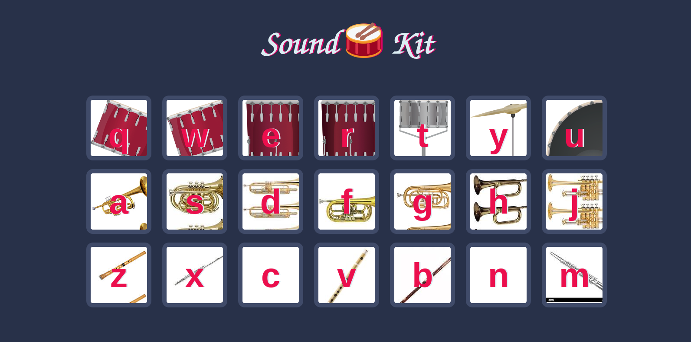

## Table of Contents
* Introduction
* Technologies
* Setup
* Features

## Drum Kit
Website that generate different sounds, such as drum, trumplet and flute sound based on the keyboard presses or mouse press. Different collections of sounds
are organized based on rows, The top row refers to drum sound, Middle row is trumplet sound and the bottom row is flute sound.

## Technologies
This Project is created with:
* Javascript ES13
* CSS3
* HTML5

## Setup
To run this project, clone the repository to your local machine and then run/open the index.html file using the browser of your choice.

## Features
Website landing page:

